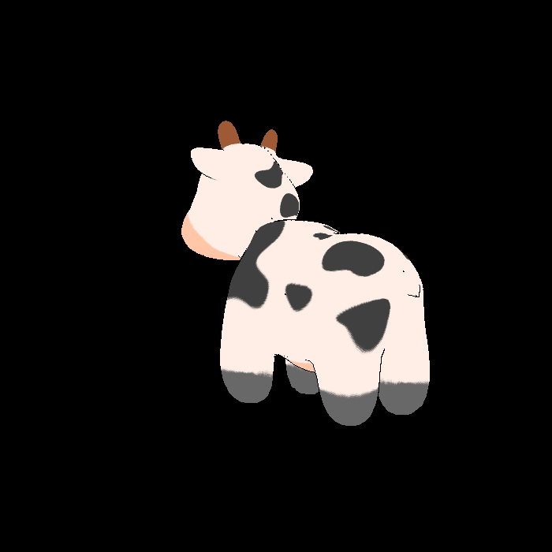
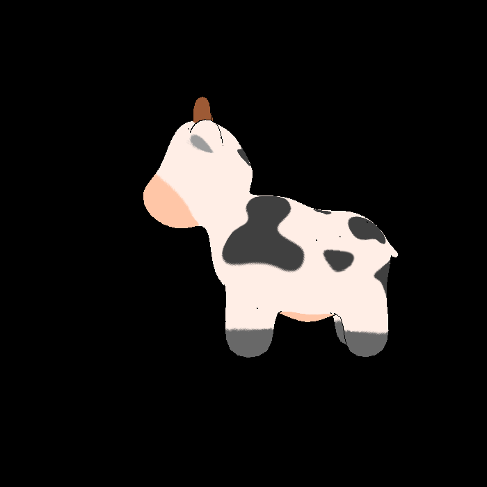
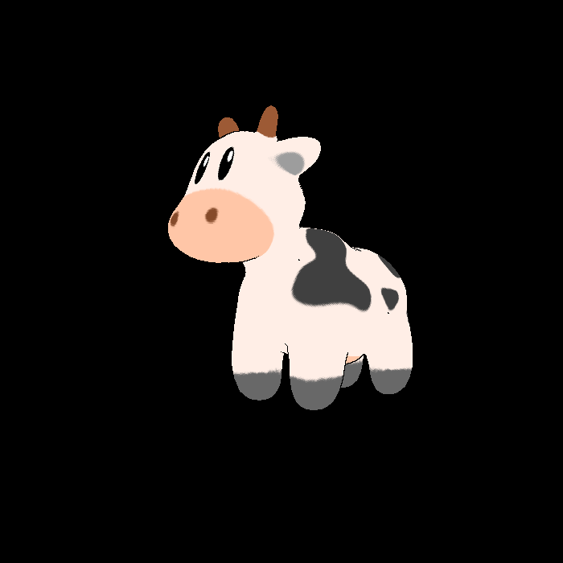

# 3R2
在 GAMES101 作业3的代码框架基础上，新建一种光栅化渲染方式,使三维牛牛网格的成像具有二维图像的属性，以实现三渲二的艺术效果








# 使用方式

```shell
git clone git@github.com:Joviisaus/3R2.git
cd 3R2
mkdir build
cd build
cmake ..
make
./Rasterizer filename.png 3r2
```

🌟 本项目依赖于 Eigen 和 OpenCV 若您使用的不是 arm 架构 Mac 电脑或者没有通过 homebrew 安装该工具，请安装并根据自己电脑的相关配置修改 Cmake 文件
